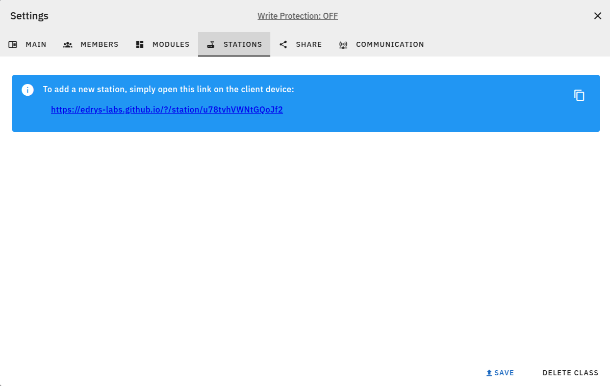

<!--

author:   André Dietrich; Jihad Hyadi

version:  0.0.1

language: en

comment:  edrys-Lite Documentation

icon:     images/logo.png

narrator: UK English Female

-->

# edrys-Lite Documentation

Welcome to the edrys-Lite documentation!

    --{{0}}--
Edrys-Lite provides an intuitive and simplistic way for users to engage with laboratory environments directly from their browser -- nearly no servers required.
This documentation will guide you through the process of creating and managing interactive classrooms, developing modules, and exploring the various features of edrys-Lite.

- 📖 Use the contents below to get started
- 💬 For questions and discussions, please visit our
  [Gitter community](https://gitter.im/edrys-org/community)
- 🐞 For bug reports and feature requests, visit the
  [issues tab](https://github.com/edrys-labs/edrys-lite/issues)
- [](https://liascript.github.io/course/?https://raw.githubusercontent.com/edrys-labs/documentation/refs/heads/main/README.md)


## Contents

    --{{0}}--
This documentation is divided into three main sections.
The first will introduce you to edrys-Lite and its core principles and technologies.
The second will guide you through the process of creating interactive classrooms and labs using edrys-Lite.
The third section will provide an overview of developing modules for edrys-Lite.

1. [Introduction to edrys-Lite](#Introduction-to-edrys-Lite)
2. [Lab-Creation](#Lab-Creation)
3. [Developing Modules](#Developing-Modules)


## Introduction to edrys-Lite

    --{{0}}--
Based on [edrys](https://github.com/edrys-org/edrys), edrys-Lite is a lightweight, browser-based implementation designed for remote labs and classrooms.
It enables seamless collaboration by allowing users to create and interact with various modules such as textual and graphical editors, terminals, camera streams, and drawing tools.
The modular architecture ensures that each module operates as an independent entity, making it configurable and reusable across different educational and experimental contexts.

### Principles and Technologies

    --{{0}}--
As you will learn later, edrys-Lite employs a modular approach where each module can be interconnected to facilitate interaction and communication among users. The system utilizes a simple publish-subscribe (pub-sub) mechanism to enable real-time message exchange between users, it uses Conflict-Free-Replicated Datatypes (CRDTs) ensuring a synchronized state.

### WebRTC Communication

>    --{{0}}--
> The Web Real-Time Communication is a free and open-source project providing web browsers and mobile applications with real-time communication (RTC) via application programming interfaces (APIs).
> It allows audio and video communication to work inside web pages by allowing direct peer-to-peer communication, eliminating the need to install plugins or download native apps...
>
> _Source: [Wikipedia](https://en.wikipedia.org/wiki/WebRTC)_


    {{0-1}}
``` ascii
                     (WebRTC)
Alice 👩‍💻 <------------------------------> 👨🏾‍💻 Bob
```

    --{{1}}--
But the entire process is actually a bit more complicated. At first Alice initiates the WebRTC connection by generating an SDP offer that details her media capabilities, such as the types of audio and video streams she supports, along with the associated codecs and network parameters. This offer is then sent to the signaling server, which acts solely as a relay for connection setup information.

    --{{2}}--
The signaling server receives Alice’s offer and forwards it to Bob. This intermediary role is crucial because it allows the initial exchange of connection data even when both parties are behind NATs or firewalls, ensuring that they can communicate the necessary parameters without directly connecting first.

    --{{3}}--
After Bob receives Alice’s offer through the signaling server, he generates an SDP answer that outlines his media capabilities and confirms the proposed connection parameters. This answer provides a mutual understanding of the media exchange, indicating that Bob is ready to establish a connection and detailing his own network settings.


    {{1}}
``` ascii
               (Signaling Server)

       .-------------> 🖥️ --------------.
       |    "{1}{}"   /  A      "{2}{}" |
       |             /    \             |
       |            /      \            V
                   /        \
Alice 👩‍💻 <--------'          '--------- 👨🏾‍💻 Bob
            "{4}{}"             "{3}{}"
      A                                  A
      |                                  |
      '----------------------------------'
      A    "{5}{Direct Communication}"   A
      |                                  |
      '-- - - - - - - - - - - - - - - - -'
             "{6}{InDirect via TURN}"
```

    --{{4}}--
The signaling server then relays Bob’s SDP answer back to Alice. This step completes the signaling handshake, allowing both peers to possess the required session descriptions that enable them to move forward with establishing a direct connection.

    --{{5}}--
With the SDP offer and answer exchanged, Alice and Bob proceed with the ICE (Interactive Connectivity Establishment) process, wherein they gather potential network paths and perform connectivity checks. If successful, this process establishes a direct peer-to-peer connection that is optimized for low latency and secure real-time communication.

    --{{6}}--
If the direct connection attempt fails due to restrictive NATs or firewalls, the process falls back to using a TURN server. In this case, the TURN server relays media traffic between Alice and Bob, ensuring that the communication remains uninterrupted, even though it might introduce a bit more latency compared to a direct connection.


    {{7}}
> More confusing information on WebRTC:
>
>     --{{7}}--
> Simply listen to another explanation on YouTube:
>
> !?[WebRTC](https://www.youtube.com/watch?v=7cbD-hFkzY0)

### State Synchronization

    --{{0}}--
A _**C**onflict-free **R**eplicated **D**ata **T**ype_ (CRDT) is a new type of data structure[^1] that can be replicated across multiple instances in a network with the following guarantees:

    {{1}}
1. A replica can be updated independently, concurrently and without coordinating with other replicas.
2. Inconsistencies can be resolved automatically.
3. Although replicas may have different state, they are guaranteed to eventually converge.

<!-- --{{1}}--
CRDTs allow each replica to be updated independently and concurrently without needing to coordinate with other replicas, meaning that changes can be made even when devices are disconnected or operating in parallel. Any inconsistencies that arise from these independent updates are automatically resolved by the system, ensuring that differences are managed seamlessly. Even though replicas might temporarily have different states, the underlying design guarantees that they will eventually converge to a consistent state once all updates are shared.
-->

      {{2}}
__Task:__ Implement an distributed counter

    --{{2}}--
The following example is used only as an illustration of the problem that CRDTs solve. In practice, CRDTs are used to implement more complex data structures, such as sets, maps, and lists, that can be replicated across multiple devices in a network.

    --{{3}}--
In this distributed counter, both Alice and Bob start with a value of 0. Bob first adds 5 to his counter, and his update is transmitted to Alice so that her counter also reflects a value of 5. Next, Alice increments her counter by 1, raising her local value to 6; however, if this update fails to reach Bob, he remains unaware of the change and retains his previous value of 5. Later, when Bob adds 2 to his counter, his value increases to 7, creating a divergence between the two replicas. The conceptual problem here is that without the reliability and conflict-resolution guarantees provided by CRDTs, lost messages—like Alice’s +1—result in inconsistent states, as the replicas no longer converge on a single, agreed-upon counter value.

    {{3}}
``` ascii
Alice 👩‍💻

[0]---------*-->[5]--[+1 = 6]--------*-->[8]-- - - - - - - - - - - - 
           /            \           /          \
          A              V         A            \
         /                        /              \
[0]---[+5 = 5]-----------------[+2 = 7]-- - - - --*- - - - - - - - - -

Bob 👨🏾‍💻
```

    {{4}}
__Solution:__ Use Sets and Unions instead...

    --{{4}}--
How can the same problem be solved for a network with messages losses, fluctuating users and no central authority.

    --{{5}}--
In this CRDT-based approach, both Alice and Bob maintain a set of tuples that represent every action they perform—such as Alice starting with (a,0) and Bob with (b,0), then updating to (b,5) or (a,1) and later (b,7). Each time an update occurs, it is stored and transmitted as a tuple, and the overall state is determined by taking the union of all these sets. This means that even if a particular update message is lost during transmission, subsequent messages will eventually include the missing information, and the union operation will automatically reconcile the states across replicas. As a result, despite temporary message losses, both Alice and Bob will ultimately converge on the same comprehensive set of actions, ensuring consistency.

    {{5}}
``` ascii
Alice 👩‍💻

{(a,0)}----------*-->{(a,0),(b,5)}->{(a,1),(b,5)}---*-->{(a,1),(b,7)}
                /                         \        /   
               A                           V      A   
              /                                  /
{(b,0)}---{(b,5)}----------------------------{(b,7)}-----------------

Bob 👨🏾‍💻
```

    {{6}}
<section>

__ Implementations__

   --{{6}}--
There are several libraries and frameworks that provide CRDT implementations for various data structures, including sets, maps, and lists. However we apply Yjs, a popular CRDT library that offers a wide range of data types and synchronization mechanisms. Yjs is designed to work seamlessly with WebRTC and other real-time communication protocols, making it an ideal choice for building collaborative applications that require consistent state synchronization across multiple users.

   --{{7}}--

- [Automerge](https://automerge.org)
- [__Yjs__](https://docs.yjs.dev)

</section>


[^1]: The CRDT concept was defined in 2011 by Marc Shapiro, Nuno Preguiça, Carlos Baquero and Marek Zawirski.

      See also: https://en.wikipedia.org/wiki/Conflict-free_replicated_data_type


## Lab Creation

    --{{0}}--
edrys-Lite enables teachers to create interactive classrooms and labs by combining various modules to suit their educational needs.
The platform supports a wide range of modules, including text editors, graphical editors, terminals, camera streams, and drawing tools, among others.
Teachers can easily add modules to their classrooms and configure them to create engaging and interactive learning experiences for students.

?

### Roles

    --{{0}}--
Before starting, you have to be aware of the three different roles in edrys-Lite:

- **Teacher**: Configure and manage the classrooms.
- **Student**: Interact with the modules and collaborate with peers.
- **Station**: Act as a resource node that may represent specialized hardware.

    --{{1}}--
With its browser-native design, edrys-Lite provides an accessible and efficient platform for collaborative learning, leveraging modern web technologies to facilitate real-time interaction between students, teachers, and hardware-enabled stations.

### Creating a Classroom

The teacher is responsible for creating a classroom and can also open a station. (Note: The teacher can also participate as a student.)

*    --{{1}}--
  Visit https://edrys-labs.github.io and click on `Create a class`.
  By the way, the buttons in the footer allow you to have a look at the project on GitHub and to explore several ready-to-use remote-labs.

       {{1}}
  
  
*    --{{2}}--
  A new classroom will be generated with a unique ID in the URL.
  You can share this URL with your students to join the classroom.
  Every classroom is created with a starting [Reference Module](https://github.com/edrys-labs/module-reference).

       {{2}}
  

    --{{3}}--
  This is the initial classroom view. Since you have created it, you are the teacher, only you can configure the classroom and add modules and also add other teachers and students. Your userID is displayed in the top right corner, it is unique for each user and browser and it is randomly generated.


### Adding Meta Information

    --{{0}}--
If you click onto the `Settings` button, the main settings will be shown. Here you can reference a logo add a description to your classroom was well as an descriptive title. The number of room defines the initial number of rooms in the classroom, only teachers can add more rooms manually.

      {{0}}


    --{{1}}--
These meta information are also shown in the classroom overview.
So you can come back and revisit the classroom later, the configuration is stored within the browser.

      {{1}}


### Membership

    --{{0}}--
By clicking onto `Members` you can add other teachers and students to the classroom.
You can add them by their unique user ID, which is displayed in the top right corner of their browser.

      {{0}}


    --{{1}}--
By default everyone who knows the classroom URL can join the classroom as a student.
If you add teacher IDs, these users will also have access to the settings to make modifications.
If you add student IDs, you restrict the access to the rooms, all other can still join the classroom, but they are not allowed anymore to make modifications. They will become only visitors who can only watch, but all of their messages and state changes will be blocked


### Adding Modules

    --{{0}}--
If you click onto the `Settings` button and then onto modules, you can add new elements to the classroom:

    --{{1}}--
Using the Modules Explorer, you can add modules to the classroom by clicking on the `Add` button.

      {{1}}


    --{{2}}--
For more modules, you can click onto the `Explore More` button in the Explorer, you will see a list of all modules.
Every module possesses a description about the configuration and with an __include URL__.
You can copy the URL of a module and paste it into the input field.

      {{2}}


    --{{3}}--
After adding a module, you can modify where it will be shown (lobby/station), adjust its styling (width/height), and add other settings.

      {{3}}


    --{{4}}--
You can also drag and drop the modules to rearrange them in the classroom.

    --{{5}}--
Some of the most used edrys modules are:

      {{5}}
- [Code Editor](https://github.com/edrys-labs/module-editor): A code editor that supports multiple languages.

- [Video Stream](https://github.com/edrys-labs/module-station-stream): A video stream module that can be used to stream video from a station.

- [PyxTerm.js Terminal](https://github.com/edrys-labs/module-pyxtermjs): A terminal module that can be used to run the code received from the editor.

- More modules can be found in: https://github.com/topics/edrys-module

### Stations

    --{{0}}--
Well as mentioned earlier, a station is a special room that can be opened to interact with hardware or to provide a special service.
Hence, the URL looks a bit different, instead of classroom it is a station.
Therefor the browser will know that it has to operate in another mode.



    --{{1}}--
The station will be shown as a separate room in the classroom, and students can interact with it by clicking on the room.
Additionally every station has its own user, which is displayed in the right.
By changing the station name also the user name will be changed.
You can open multiple stations, in parallel on different devices to have multiple hardware resources available.
When the station URL is closed, the corresponding room will automatically disappear from the class.

      {{1}}


#### Working with Stations

    --{{0}}--
Edrys-Lite stations enable remote labs, automated grading, and other experiences where an automated or hardware-based interaction is required.
A station is simply an instance of an edrys-Lite classroom running in "station mode" and left open to handle student interactions.
The functionality of a station is determined by the modules loaded within it.

    --{{0}}--
Stations can run on any device with a browser, including servers, laptops, Raspberry Pis, or even always-on smartphones.

<section>

To create a station:

- Navigate to Settings => Stations and open the station URL (only a teacher can open a station).

- Once opened, the station will appear as a dedicated room within the class.

- Students can interact with the station by clicking on the room, or they can start working on the remote lab (e.g. writing and uploading code to a connected Arduino board).

- When the station URL is closed, the corresponding room will automatically disappear from the class.

</section>

     {{1}}
<section>

#### Debugging

    --{{1}}--
Since stations are intended to run for long periods of time, it is important to ensure that they are stable and reliable.
Thus, by clicking onto the `Debug` button, you can see the current state of the station, you can start recording memory, network, browser console output and user connections.

      {{1}}


    --{{2}}--
All of these records will be stored in the browser and can be later inspected and replayed.

      {{2}}


</section>

#### Example Arduino Remote Lab

    --{{0}}--
An example use case of stations is to create a remote Arduino Lab, where students can remotely interact with an Arduino (upload code to it and see the result through a camera) that is physically hosted somewhere else (eg. university grounds).
In this example, a university would like to allow its students access to their fleet of lab devices remotely, removing any need for students to be physically present to experiment with the devices.

    --{{1}}--
To achieve this with Edrys, each Arduino would be connected to a computer with internet access (in this example a Raspberry Pi), and a station would be open on the each computer's browser.
We can use a USB webcam with the [Station-Stream](https://github.com/edrys-labs/module-station-stream) module to let students see the Arduino, the [Code Editor](https://github.com/edrys-labs/module-editor) module to allow students to upload code to it, and the [PyxTerm.js Terminal](https://github.com/edrys-labs/module-pyxtermjs) module, which needs a simple server running locally to allow the Arduino to communicate with the browser.

      {{1}}
1. [Station-Stream](https://github.com/edrys-labs/module-station-stream)
2. [Code Editor](https://github.com/edrys-labs/module-editor)
3. [PyxTerm.js Terminal](https://github.com/edrys-labs/module-pyxtermjs)

    --{{2}}--
The overall setup for one station could look like this:

      {{2}}
<div align="center">

</div>

    --{{3}}--
Overall, this allows easy set up of remote labs without configuring security, servers, port forwarding, or any other infrastructure.
All that is needed is a browser running, which can be repeated for any number of stations.
This produces a portable, scalable, and easy-to-share setup that can be replicated even by non-technical teachers.
The same principles apply to any other lab devices (since modules can be reused, combined, or developed to accommodate any setup).


### Loading and Saving Configurations

     --{{0}}--
Open Settings and then Share will allow you to store and restore existing lab configurations.


    --{{1}}--
You can either store your current configuration and download it as a JSON or YAML file, whereby we prefer YAML for a better readability.
The result will look similar to the following example, which can be modified manually or shared with others.

     {{1}}
```yaml
id: unique id of the lab
createdBy: teacher's id
dateCreated: date of creation
name: name of the lab
meta:
  logo: url of the lab logo
  description: description of the lab
  defaultNumberOfRooms: number of rooms 
members:
  teacher: array of teacher ids
  student: array of student ids
modules:
  - url: url of the module
    config: available for everyone
    studentConfig: available for students
    teacherConfig: available for teachers
    stationConfig: available in stations
    showInCustom: room where the module will be shown
    width: Full/Half/Quarter (or a custom value)
    height: Huge/Tall/Medium/Short (or a custom value)
```

    --{{2}}--
You can restore this configuration either from your you local file system or if it is hosted somewhere on the web, then you can simply paste the URL of the file and restore it from the web.

    --{{3}}--
Some ready-to-use classroom configurations are available in the following repositories (You can also just click the deploy-button of the desired configuration):

      {{3}}
https://github.com/topics/edrys-lab

    --{{4}}--
Deploy-buttons are a shortcut to create a new classroom with the configuration of the repository. The only relevant part is the URL of the configuration file, which is appended to `https://edrys-labs.github.io/?/deploy/`.
This will instruct edrys-Lite to create a new classroom with the configuration fetched from the given URL.

      {{4}}
```markdown
[fast deploy](https://edrys-labs.github.io/?/deploy/https://raw.githubusercontent.com/edrys-labs/lab-web-serial/main/laboratory/micropython.yaml)
```

    --{{5}}--
You can try this out by yourself by clicking on the following button:

      {{5}}
[](https://edrys-labs.github.io/?/deploy/https://raw.githubusercontent.com/edrys-labs/lab-web-serial/main/laboratory/micropython.yaml)


## Developing Modules

    --{{0}}--
Edrys labs are based on the concept of "modules".
A module is a classroom/lab building block.
You can create your own modules or explore existing modules and add them to your classroom.

    --{{1}}--
A module is just an HTML page that is run in an iframe and shown to your students, teachers, and on stations.
You can make the module behave differently depending on where it is currently loaded.
Modules use the Edrys.js library to send and receive messages in real time, allowing you to build any live functionality without setting up any real-time infrastructure, authenticating users, or configuring anything else, as that is all handled upstream by Edrys.

      {{1}}
<!-- data-marker="14 0 14 200 log" -->
``` html
<!DOCTYPE html>
<html lang="en">
  <head>
    <meta charset="UTF-8" />
    <meta http-equiv="X-UA-Compatible" content="IE=edge" />
    <meta name="viewport" content="width=device-width, initial-scale=1.0" />

    <meta
      name="description"
      content="A reference module to help with development"
    />
    <meta name="show-in" content="*" />
    <title>Reference Module</title>

    <script src="https://edrys-labs.github.io/module/edrys.js"></script>
   ...
```

    --{{2}}--
You can also inspect the reference module, which is a good starting point for developing your own modules.
It shows how to use the edrys.js library and how to interact with the environment to send and receive messages, update the state.

      {{2}}
https://github.com/edrys-labs/module-reference/blob/main/index.html


    --{{3}}--
You can also explore existing ready-to-use modules, check out the:

      {{3}}
[`edrys-module` tag on GitHub](https://github.com/topics/edrys-module).


### `edrys.js`

    --{{0}}--
The Edrys JavaScript client library provides an interface to interact with Edrys live classrooms.
It includes reactive properties and various functions to manage messaging, updates, and local storage.

#### Properties

    {{0}}
<section>

##### `Edrys.ready`

Boolean indicating if Edrys is initialized.

```js
console.log(Edrys.ready); // true or false
```

---

</section>

    {{1}}
<section>

#### `Edrys.role`

User role within the classroom.

```js
console.log(Edrys.role); // "teacher", "student", or "station"
```

---

</section>

    {{2}}
<section>

#### `Edrys.username`

The username of the current user.

```js
// Current user's username
console.log(Edrys.username);
```

---

</section>

    {{3}}
<section>

#### `Edrys.module`

Users of the module can pass in some run-time configuration to your module to customize its behavior.

```js
// Always available
console.log(Edrys.module.config);
// Only available when this module is loaded to a student
console.log(Edrys.module.studentConfig);
// Only available when this module is loaded to a teacher
console.log(Edrys.module.teacherConfig);
// Only available when this module is loaded on a station
console.log(Edrys.module.stationConfig);
```

---

</section>

    {{4}}
<section>

#### `Edrys.liveClass`

Reactive object representing the live classroom state.

```js
// List of users in the classroom
console.log(Edrys.liveClass.users);
// List of rooms in the classroom
console.log(Edrys.liveClass.rooms);
```

---

</section>

    {{5}}
<section>

#### `Edrys.liveRoom`

Reactive object representing the live room state.

```js
console.log(Edrys.liveRoom.name); // Room name
```

---

</section>

    {{6}}
<section>

#### `Edrys.liveUser`

Reactive object representing the live user state.

```js
// User's display name
console.log(Edrys.liveUser.displayName);
// User's current room
console.log(Edrys.liveUser.room);
```

---

</section>

    {{7}}
<section>

#### `Edrys.debug`

Prints debug messages to the console.

```js
Edrys.debug = true
```

</section>

#### Event Handling

      {{1}}
<section>

##### `Edrys.onReady(handler)`

Register a handler to be called when Edrys is ready.

```javascript
Edrys.onReady(() => console.log("Module is loaded!"));
```

</section>

      {{2}}
<section>

##### `Edrys.onUpdate(handler)`

Register a handler to be called on any real-time state changes.

```javascript
Edrys.onUpdate(() => console.log("Module is updated!"));
```

</section>

#### Messaging

    --{{0}}--
Modules can send and receive messages in real time.
Messages are sent to a specific user only or to all users in __the same room__.

      {{1}}
<section>

##### `Edrys.sendMessage(subject, body, user?)`

- Sends a message with the given subject and body.
- The body can be of any type, this will be automatically serialized and deserialized by using [msgpackr](https://github.com/kriszyp/msgpackr).
- user(optional): the user to send the message to, this is the `from` field when receiving the message with the `onMessage` handler.

```javascript
Edrys.sendMessage("subject", "body");
```

---

</section>

      {{2}}
<section>

##### `Edrys.onMessage(handler, promiscuous?)`

- Registers a handler for receiving messages.
- `handler({ from, subject, body })`: Called when a message is received.
- `promiscuous`: If true, listens to all messages in the room; otherwise, only listens to messages for the current module.

``` javascript
Edrys.onMessage(({ from, subject, body }) => {
  console.log("Got new message: ", from, subject, body);
});
```

</section>

#### Local Storage

Modules can store data locally to persist state across sessions within the browser.

    {{1}}
<section>

##### `Edrys.setItem(key, value)`

Stores a value in local storage, scoped to the current class and user room.

``` javascript
Edrys.setItem("key", "value");
```

---

</section>

    {{2}}
<section>

##### `Edrys.getItem(key)`

Retrieves a stored value from local storage.

```javascript
Edrys.getItem("key");
```

</section>

#### State Management

    --{{0}}--
Edrys.js initializes by listening to message events from its parent frame and sets up reactive state management using Yjs.
It therefor uses the same datatypes as Yjs.

Yjs documentation: https://docs.yjs.dev/api/shared-types

    {{1}}
<section>

##### `Edrys.getState(key?, type?, value?)`

- Retrieves or initializes a state entry.
- type: Can be one of `Map`, `Array`, `Text`, `XmlFragment`, `XmlText`, `XmlElement`, or `Value`.
- If type is Value, an optional value can be provided.

```javascript
const state = Edrys.getState("key", "Map");

// set two values in the map
state.set('option1', 12)
state.set('option2', [12 , 22, true])

// get the value of option1
console.log(state.get('option1')) // 12

// get the entire map
console.log(state.toJSON())
// Object { option1: 12, option2: [1, 2, 3] }
```

---

</section>

    {{2}}
<section>

##### `Edrys.updateState(transaction : () => {})`

Since every state update will trigger the `Edrys.onUpdate` handler, it is recommended to use the `updateState` method to batch state updates.

```javascript
const state = Edrys.getState("key", "Map");

Edrys.updateState(() => {
  state.set('option1', 12)
  state.set('option2', [12 , 22, true])
  state.set('option3', "a string")
});
```

---

</section>

    {{3}}
<section>

##### `Edrys.clearState(key)`

Removes a state entry from the current room.

```javascript
Edrys.clearState("key");
```

</section>

#### Streaming

    --{{0}}--
A module can also share a stream of data. This can be used to share video, audio... with other users in the room.

    {{1}}
<section>

##### `Edrys.sendStream(stream)`

Sends a stream to all users in the station.

```javascript
navigator.mediaDevices.getUserMedia({
  video: Edrys.module.stationConfig?.video ?? true,
  audio: Edrys.module.stationConfig?.audio ?? true,
}).then(async (stream) => {
  videoElement.srcObject = stream;
  videoElement.autoplay = true;
    
  await Edrys.sendStream(stream);
  ...
```

---

</section>

    {{2}}
<section>

##### `Edrys.onStream(handler)`

Registers a handler for receiving streams.

```javascript
Edrys.onStream((stream, settings) => {
  videoElement.srcObject = stream;

  // A function to apply video settings (only video/audio, rotate...)
  applyVideoTransform(videoElement, settings);
});
```

</section>

### Metadata

Edrys scrapes module HTML files for metadata. It looks at meta tags in your HTML
and stores this information. The following meta tags can be set:

- `title`: \
  the page title tag will be used as the module name

- `description`: \
  module description that will be shown to people adding your module.
  The description can consist of HTML with links and base configuration examples as well.

- `show-in`: \
  defines where the module will be shown.
  Can be "*" to load it everywhere, "lobby" for the Lobby and other rooms, or "station" to load it only on Stations

- `fetch`: \
  this cannot be used for every module, but it allows to fetch the index.html directly without the need of hosting.
  This is especially useful for modules that might change in the future, but you want to have a stable version.
  Hence, you can use the URL to a tagged version on GitHub, which will not destroy other experiments if the module configuration changes.

  Checkout the Markdown-It module on: https://github.com/edrys-labs/module-markdown-it

### YAML-Modules

    --{{0}}--
To simplify the development of some modules, we have introduced the concept of YAML modules.
These modules are defined in a YAML file, which are fetched and translated into HTML.
The Markdown-It module is a good example of this concept.

https://github.com/edrys-labs/module-markdown-it

    --{{1}}--
As the example shows, a YAML module consists of a simple configuration, that mirror the meta information, with `load` you can define all necessary scripts and styles to be loaded.
The `body` is just a string representation of the HTML body, whereby `main` defines the JavaScript code to be executed.

      {{1}}
``` yaml
name: Markdown-IT

description: Write Markdown as task-descriptions for your students, this markdown interpreter additionally allows to integrate formulas, ASCII-art and videos. For more information, see <br><a href='https://github.com/Cross-Lab-Project/edrys_module-markdown-it' target='_blank'>https://github.com/Cross-Lab-Project/edrys_module-markdown-it</a>

show-in:
  - '*'

load:
  scripts:
    - dist/index.js   
    - https://cdnjs.cloudflare.com/ajax/libs/highlight.js/11.7.0/highlight.min.js
    - https://cdn.jsdelivr.net/npm/markdown-it-texmath/texmath.min.js
    - https://cdn.jsdelivr.net/npm/katex/dist/katex.min.js
    - https://cdnjs.cloudflare.com/ajax/libs/mermaid/9.2.2/mermaid.min.js
    - https://cdnjs.cloudflare.com/ajax/libs/markdown-it/13.0.1/markdown-it.min.js
    - https://edrys-labs.github.io/module/vendor/alpine.min.js
    - https://edrys-labs.github.io/module/edrys.js

  links:
    - https://cdnjs.cloudflare.com/ajax/libs/highlight.js/11.7.0/styles/default.min.css
    - https://cdn.jsdelivr.net/npm/markdown-it-texmath/css/texmath.min.css
    - https://cdn.jsdelivr.net/npm/katex/dist/katex.min.css
    - https://edrys-labs.github.io/module/vendor/water.min.css
    - https://edrys-labs.github.io/module/vendor/open-iconic/css/open-iconic.min.css

style: |-
  body {
    margin: 0px;
    padding: 1rem;
    min-width: calc(100% - 2rem);
  }

body: ""

main: |-
  function init() {
    if (window.md) return

    if (!window.markdownItTextualUml) {
      setTimeout(init, 100)
      return
    }

    window.md = markdownit()

    // enable everything
    window.md.options.html = true
    window.md.options.linkify = true
    window.md.options.typographer = true

    window.md.options.highlight = function (str, lang) {
        if (lang && hljs.getLanguage(lang)) {
            try {
                return '<pre class="hljs"><code style="border-radius: 0px">' +
                    hljs.highlight(str, {
                        language: lang,
                        ignoreIllegals: true
                    }).value +
                    '</code></pre>';
            } catch (__) {}
        }

        return '<pre class="hljs"><code style="border-radius: 0px">' + md.utils.escapeHtml(str) +
            '</code></pre>';
    }

    window.md.use(
            texmath, {
                engine: katex,
                delimiters: 'dollars',
                katexOptions: {
                    macros: {
                        "\\RR": "\\mathbb{R}"
                    }
                }
            })
        .use(window.markdownItTextualUml)
  }

  function render(content) {
      if (window.md) {
          document.body.innerHTML = md.render(content)

          setTimeout(() => {
              console.warn("loading mermaid")
              mermaid.initialize({
                  startOnLoad: true
              })
          }, 1000)
      } else {
        setTimeout(() => {
          render(content)
        }, 100)
      }
  }

  window.onload = init

  Edrys.onReady(() => {
      console.log("Markdown-IT loaded")

      init()

      let content = Edrys.module.config || ""
      
      content += "\n\n" + ( Edrys.module[Edrys.role.toLowerCase()+'Config'] || "" )

      render(content)
  });
```