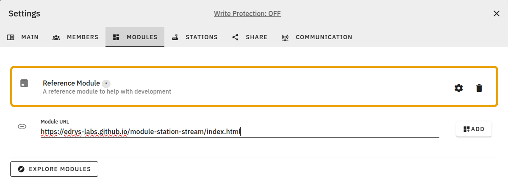

<!--

author:   André Dietrich; Jihad Hyadi

version:  0.0.1

language: en

comment:  edrys-Lite Documentation

icon:     ./images/logo.png

-->

# edrys-Lite Documentation

Welcome to the Edrys documentation!

- 📖 Use the contents below to get started
- 💬 For questions and discussions, please visit our
  [Gitter community](https://gitter.im/edrys-org/community)
- 🐞 For bug reports and feature requests, visit the
  [issues tab](https://github.com/edrys-labs/edrys-lite/issues)
- [](https://liascript.github.io/course/?https://raw.githubusercontent.com/edrys-labs/documentation/refs/heads/main/README.md)


## Contents

1. [Introduction to edrys-Lite](#Introduction-to-edrys-Lite)
2. [Lab-Creation](#Lab-Creation)
3. [Developing Modules](#Developing-Modules)


## Introduction to edrys-Lite

Based on [edrys](https://github.com/edrys-org/edrys/tree/main), edrys-Lite is a lightweight, browser-based implementation designed for remote labs and classrooms. 
It enables seamless collaboration by allowing users to create and interact with various modules such as textual and graphical editors, terminals, camera streams, and drawing tools. 
The modular architecture ensures that each module operates as an independent entity, making it configurable and reusable across different educational and experimental contexts.

### Principles and Technologies

edrys-Lite establishes browser-to-browser connections using WebRTC, a real-time communication protocol that enables direct peer-to-peer data exchange. 
To initiate these connections, a signaling server is required to help peers discover each other and establish a communication channel. 
In some network conditions, such as when users are behind strict NATs or firewalls, a STUN or/and TURN server(s) may be necessary to relay traffic and ensure connectivity.


<div style="width: 50%; margin: auto;">

``` ascii
         (Signaling Server)
      .---------> 🖥️ -----------.
     /    1      /  A       2    \
    /           /    \            V
 👩‍💻 <----------'      '---------- 👨🏾‍💻
   A      4                 3     A
   |\                            /|
     '--------------------------'
   |    5 Direct Communication    |

   |                              |
   '- - - - -  - - - - - - - - - -'
         6 InDirect via TURN
```

</div>

At its core, edrys-Lite employs a modular approach where each module can be interconnected to facilitate interaction and communication among users. The system utilizes a simple publish-subscribe (pub-sub) mechanism to enable real-time message exchange between users, ensuring a synchronized collaborative experience.

The pub-sub mechanism is built on top of [Trystero](https://oxism.com/trystero/), a peer-to-peer networking library that enhances real-time communication using WebRTC for decentralized data exchange. Additionally, it employs a custom Conflict-Free Replicated Data Type (CRDT) using [Yjs](https://docs.yjs.dev/) implementation to ensure consistent state synchronization across users, including chat functionality and module states. This decentralized approach enhances scalability and reliability in classroom environments.

edrys-Lite supports 3 main user roles:

- **Teacher**: Configure and manage the classrooms.
- **Student**: Interact with the modules and collaborate with peers.
- **Station**: Act as a resource node that may represent specialized hardware.

With its browser-native design, edrys-Lite provides an accessible and efficient platform for collaborative learning, leveraging modern web technologies to facilitate real-time interaction between students, teachers, and hardware-enabled stations.


## Lab Creation

edrys-Lite enables teachers to create interactive classrooms and labs by combining various modules to suit their educational needs. 
The platform supports a wide range of modules, including text editors, graphical editors, terminals, camera streams, and drawing tools, among others. 
Teachers can easily add modules to their classrooms and configure them to create engaging and interactive learning experiences for students.

### Creating a Classroom

The teacher is responsible for creating a classroom and can also open a station. (Note: The teacher can also participate as a student.)

* Open [Edrys-Lite](https://edrys-labs.github.io/) and click on `Create a class`.
  
* The classroom is created with a starting [Reference Module](https://github.com/edrys-labs/module-reference).

### Adding Modules

There are multiple ways to add modules to the classroom:

1. **Manually**: 

    Open Settings => Modules, and paste the module URL.

    <div align="center" style="width: 70%; margin: auto;">
      
    </div>

    After adding a module, you can modify where it will be shown (lobby/station), adjust styling (width/height), and add other settings.

    <div align="center" style="width: 70%; margin: 10px auto;">
      
    </div>

    Some of the most used edrys modules:

    - [Code Editor](https://github.com/edrys-labs/module-editor): A code editor that supports multiple languages.

    - [Video Stream](https://github.com/edrys-labs/module-station-stream): A video stream module that can be used to stream video from a station.

    - [PyxTerm.js Terminal](https://github.com/edrys-labs/module-pyxtermjs): A terminal module that can be used to run the code received from the editor.

    More modules can be found in: https://github.com/topics/edrys-module

2. **From an existing configuration**: 

    Open Settings => Share, and import the configuration from a local file or a URL. 

    <div align="center" style="width: 70%; margin: auto;">
      
    </div>

    Some ready-to-use classroom configurations are available in the following repositories (You can also just click the deploy-button of the desired configuration):

    - https://github.com/edrys-labs/edrys-exercises
    - https://github.com/topics/edrys-lab
    - https://github.com/edrys-labs/lab-tubaf-embedded-systems

3. **Create your own configuration**: 

    You can create your own configuration by creating a YAML (or JSON) file with the appropriate structure ([Example](https://github.com/edrys-labs/edrys-exercises/blob/main/labs/arduino_blink.yml)). And then import the configuration file in the classroom settings.

```yaml
  id: unique id of the lab
  createdBy: teacher's username
  dateCreated: date of creation
  name: name of the lab
  meta:
    logo: url of the lab logo
    description: description of the lab
    defaultNumberOfRooms: number of rooms 
  members:
    teacher: array of teacher ids
    student: array of student ids
  modules:
    - url: url of the module
      config: available for everyone
      studentConfig: available for students
      teacherConfig: available for teachers
      stationConfig: available in stations
      showInCustom: room where the module will be shown
      width: Full/Half/Quarter (or a custom value)
      height: Huge/Tall/Medium/Short (or a custom value)
```

### Working with Stations

Edrys-Lite stations enable remote labs, automated grading, and other experiences where an automated or hardware-based interaction is required. A station is simply an instance of an edrys-Lite classroom running in "station mode" and left open to handle student interactions. The functionality of a station is determined by the modules loaded within it.

Stations can run on any device with a browser, including servers, laptops, Raspberry Pis, or even always-on smartphones.

To create a station:

- Navigate to Settings => Stations and open the station URL (only a teacher can open a station).

- Once opened, the station will appear as a dedicated room within the class.

- Students can interact with the station by clicking on the room, or they can start workng on the remote lab (e.g. writing and uploading code to a connected Arduino board).

- When the station URL is closed, the corresponding room will automatically disappear from the class.

By following these steps, teachers can set up an interactive and fully functional online lab using edrys-Lite.

### Example Arduino Remote Lab

An example use case of stations is to create a remote Arduino Lab, where students can remotely interact with an Arduino (upload code to it and see the result through a camera) that is physically hosted somewhere else (eg. university grounds).
In this example, a university would like to allow its students access to their fleet of lab devices remotely, removing any need for students to be physically present to experiement with the devices. 

To achieve this with Edrys, each Arduino would be connected to a computer with internet access (in this example a Raspberry Pi), and a station would be open on the each computer's browser.
We can use a USB webcam with the [Station-Stream](https://github.com/edrys-labs/module-station-stream) module to let students see the Arduino, the [Code Editor](https://github.com/edrys-labs/module-editor) module to allow students to upload code to it, and the [PyxTerm.js Terminal](https://github.com/edrys-labs/module-pyxtermjs) module, which needs a simple server running locally to allow the Arduino to communicate with the browser.

The overall setup for one station could look like this:

<div align="center">

</div>

Overall, this allows easy set up of remote labs without configuring security, servers, port forwarding, or any other infrastructure. All that is needed is a browser running, which can be repeated for any number of stations. This produces a portable, scalable, and easy-to-share setup that can be replicated even by non-technical teachers. The same principles apply to any other lab devices (since modules can be reused, combined, or developed to accomodate any setup).


## Developing Modules

Edrys labs are based on the concept of "modules".
A module is a classroom/lab building block.
You can create your own modules or explore existing modules and add them to your classroom.

A module is just an HTML page that is run in an iframe and shown to your students, teachers, and on stations.
You can make the module behave differently depending on where it is currently loaded.
Modules use the Edrys.js library to send and receive messages in real time, allowing you to build any live functionality without setting up any real-time infrastructure, authenticating users, or configuring anything else, as that is all handled upstream by Edrys.

### Usage

To use a module you simply host it anywhere and paste its link into the Edrys-Lite app.

- To explore existing ready-to-use modules, check out the
  [`edrys-module` tag on GitHub](https://github.com/topics/edrys-module).
- The easiest way to start developing modules is to check the
  [Reference Module](https://github.com/edrys-labs/module-reference) which implements most functionalities of the Edrys library.
 - Bring your own stack by using Edrys.js:
 
```html
 <script src="https://edrys-labs.github.io/module/edrys.js"></script>
```

### Edrys.js 

The Edrys JavaScript client library provides an interface to interact with Edrys live classrooms. It includes reactive properties and various functions to manage messaging, updates, and local storage.


#### Properties

> **Edrys.ready**

Boolean indicating if Edrys is initialized.

```js
console.log(Edrys.ready); // true or false
```

> **Edrys.role**

User role within the classroom.

```js
console.log(Edrys.role); // "teacher", "student", or "station"
```

> **Edrys.username**

The username of the current user.

```js
console.log(Edrys.username); // Current user's username
```

> **Edrys.module**

Users of the module can pass in some run-time configuration to your module to customize its behavior.

```js
console.log(Edrys.module.config); // Always available
console.log(Edrys.module.studentConfig); // Only available when this module is loaded to a student
console.log(Edrys.module.teacherConfig); // Only available when this module is loaded to a teacher
console.log(Edrys.module.stationConfig); // Only available when this module is loaded on a station
```

> **Edrys.liveClass**

Reactive object representing the live classroom state.

```js
console.log(Edrys.liveClass.users); // List of users in the classroom
console.log(Edrys.liveClass.rooms); // List of rooms in the classroom
```

> **Edrys.liveRoom**

Reactive object representing the live room state.

```js
console.log(Edrys.liveRoom.name); // Room name
```

> **Edrys.liveUser**

Reactive object representing the live user state.

```js
console.log(Edrys.liveUser.displayName); // User's display name
console.log(Edrys.liveUser.room); // User's current room
```


#### Event Handling

> **Edrys.onReady(handler)**

Register a handler to be called when Edrys is ready.

```javascript
  Edrys.onReady(() => console.log("Module is loaded!"));
``` 

> **Edrys.onUpdate(handler)**

Register a handler to be called on any real-time state changes.

```javascript
  Edrys.onUpdate(() => console.log("Module is updated!"));
```

#### Messaging

Modules can send and receive messages in real time. Messages are sent to a specific user or to all users in the classroom.

> **Edrys.sendMessage(subject, body, user?)**

* Sends a message with the given subject and body.
* user(optional): the user to send the message to.

```javascript
  Edrys.sendMessage("subject", "body");
```

> **Edrys.onMessage(handler, promiscuous?)**

* Registers a handler for receiving messages.
* handler({ from, subject, body }): Called when a message is received.
* promiscuous: If true, listens to all messages; otherwise, only listens to messages for the current module.

```javascript
  Edrys.onMessage(({ from, subject, body }) => {
    console.log("Got new message: ", from, subject, body);
  });
```

#### Local Storage

Modules can store data locally to persist state across sessions.

> **Edrys.setItem(key, value)**

Stores a value in local storage, scoped to the current class and user room.

```javascript
  Edrys.setItem("key", "value");
```

> **Edrys.getItem(key)**

Retrieves a stored value from local storage.

```javascript
  Edrys.getItem("key");
```

#### State Management

Edrys.js initializes by listening to message events from its parent frame and sets up reactive state management using Yjs.

> **Edrys.clearState(key)**

Removes a state entry from the current room.

```javascript
  Edrys.clearState("key");
```

> **Edrys.updateState(callback, origin)**

Updates the state of the current room.

```javascript
  Edrys.updateState((state) => {
    state.set("key", "value");
  });
```

> **Edrys.getState(key?, type?, value?)**

* Retrieves or initializes a state entry.
* type: Can be one of Map, Array, Text, XmlFragment, XmlText, XmlElement, or Value.
* If type is Value, an optional value can be provided.

```javascript
  Edrys.getState("key", "Map");
```

#### Metadata

Edrys scrapes module HTML files for metadata. It looks at meta tags in your HTML
and stores this information. The following meta tags can be set:

- `description`:
  module description that will be shown to people adding your module.
  The description can consist of HTML with links and base configuration examples as well.
- `show-in`:
  defines where the module will be shown.
  Can be "*" to load it everywhere, "chat" for the Lobby and other chat-rooms, or "station" to load it only on Stations
- `title`: the page title tag will be used as the module name


